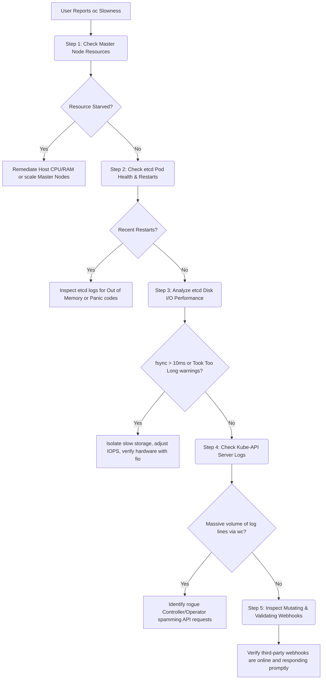

Here is the completely expanded, all-inclusive **Master Reference & Troubleshooting Guide**. This version captures every single architectural detail, command, and scenario we analyzed across all parts of our discussion—fully structured for easy storage in your GitHub repository.

---

# 🔗 OpenShift & Kubernetes Core Architecture & Troubleshooting Handbook

## 1. Core Control Plane & Process Management

### Why Have an etcd Controller with Static Pods?

* **Process Management (Kubelet):** The Kubelet on a master node is completely unaware of application logic. It checks `/etc/kubernetes/manifests/` for static pod definitions (like etcd, api-server). Its only job is to ensure the Linux container process is running. It cannot fix database-level issues (e.g., Raft split-brain, data corruption).
* **Database Management (etcd Controller/Operator):** Acts as an automated, domain-specific Database Administrator (DBA). It understands Raft consensus, performs database compaction/defragmentation, monitors cluster health, handles safe scale-up/down actions (`etcdctl member add`), manages mTLS certificate generation and rotation, and handles disaster recovery.

---

## 2. etcd: Deep Dive & Storage Mechanics

### Raft Consensus Algorithm

* **Leader:** The central coordinator. Processes all write requests, replicates logs to followers, and sends constant heartbeat messages to maintain authority.
* **Follower:** Completely passive. Replicates logs sent by the leader and responds to heartbeats.
* **Candidate:** If a follower misses a heartbeat within a randomized election timeout (typically 150ms–300ms), it transitions to a Candidate, increments the cluster term, and requests votes from peers.
* **Quorum:** The strict majority needed to elect a leader or commit any write. Calculated as:

$$\lfloor N/2 \rfloor + 1$$


where $N$ is the total number of members. For a 3-node cluster, quorum is 2. For a 5-node cluster, quorum is 3.

### Storage Architecture (Two-Phase Writes)

1. **Write-Ahead Log (WAL):** Located at `/var/lib/etcd/member/wal/`.
* Pre-allocated, append-only binary log files (64MB chunks).
* **Phase 1:** Every incoming write transaction is appended sequentially to the WAL *before* it is processed. This ensures data survival during sudden power failure.


2. **BoltDB Backend Store:** Located at `/var/lib/etcd/member/snap/db`.
* A B+ tree database file representing the current keyspace state.
* **Phase 2:** Once the transaction is accepted by a quorum of nodes via Raft, it is applied to memory and periodically written/checkpointed down to the BoltDB file on disk.


### Database Maintenance: Compaction vs. Defragmentation

* **Compaction:** etcd uses Multi-Version Concurrency Control (MVCC), meaning it never overwrites a key; it appends a new revision. Compaction marks older historical revisions as deleted, freeing up *logical* internal space ("empty slots") for new data. It does **not** shrink the physical file size on disk. OpenShift runs this automatically every 5 minutes.
* **Defragmentation:** Reorganizes the internal B+ tree layout of the BoltDB file, releasing unused logical space back to the underlying Linux filesystem. This physically shrinks the `db` file size on disk.
* *Critical Rule:* Defragmentation temporarily locks the database. It must be performed **one node at a time**, targeting followers first and finishing with the leader.


---

## 3. Worker Node Architecture: Compute, Runtimes, and Networking

### Kubelet Responsibilities

* **Node Agent:** Operates selfishly to maintain its local host. Constantly watches the API Server for assigned `PodSpecs`.
* **Pod Lifecycle Management:** Coordinates container creation and destruction by sending instructions to the Container Runtime Interface (CRI).
* **PodSpec Watchdog:** Monitors running states. Ruthlessly triggers Out-Of-Memory (OOM) kills if a container exceeds its defined cgroup limits to protect the parent host.
* **Probes Execution:**
* **Liveness Probes:** Restarts deadlocked or frozen containers.
* **Readiness Probes:** Controls traffic routing. Signals the network layer when an application is fully initialized and ready to take requests.


* **Resource Reporting:** Sends periodic heartbeats containing CPU/RAM capacities and local health statuses back to the API Server.

### Kubelet Orders: The Three Inputs

1. **API Server:** The standard path for 99% of normal tenant deployments.
2. **Local File Path (Static Pods):** Used to initialize the Control Plane itself before the API server exists.
3. **HTTP Endpoint:** Used to fetch configuration manifests from a remote URL (common in specialized Edge/IoT nodes).

### Kubelet vs. Kube-Proxy

* **Kubelet:** Manages **Compute** (CPU, RAM, container execution, image pulling).
* **Kube-Proxy:** Manages **Networking**. Watches the API server for `Service` definitions and dynamically configures local Linux packet-filtering mechanisms (`iptables` or `IPVS`) to route traffic to pod endpoints.

### CRI-O Runtime Architecture

1. **Pod Sandbox Management:** Sets up shared Linux namespaces and network loops (often creating a tiny `pause` container) to build the isolation boundary for a pod.
2. **Image Management:** Pulls structural image layers down from external container registries.
3. **Storage Layering (OverlayFS):** Organizes files into a "layer cake" configuration:
* **LowerDir (Read-Only):** The base container image layers. Shared across all identical containers on the node to maximize storage savings.
* **UpperDir (Read-Write):** A thin, temporary layer mounted on top, isolated for each active container instance. All file mutations happen here.
* **Merged View:** The unified view presented to the running application process.


4. **OCI Runtime Execution:** CRI-O translates its internal state into an Open Container Initiative (OCI) JSON spec and calls a low-level engine like **`runc`** to spin up the actual Linux process.
5. **Continuous Monitoring (`conmon`):** A small, low-overhead daemon attached to each container. It captures standard output (`stdout`/`stderr`) logs for `kubectl/oc logs` and monitors process exit codes to alert the Kubelet if a crash occurs.

---

## 4. OpenShift Internal Image Registry

### Structural Components

* **Cluster Image Registry Operator:** Evaluates and maintains the lifecycle of the registry stack. Configured via the `configs.imageregistry.operator.openshift.io/cluster` custom resource.
* **Registry Pods:** Scalable, stateless web frontends that process docker registry API calls (pushes/pulls).
* **Registry Service:** An internal cluster load balancer that routes traffic evenly across all backend registry pods.
* **Shared Storage Backend:** A mandatory shared storage architecture (Object Storage like AWS S3/Azure Blob or a ReadWriteMany/RWX shared filesystem like NFS/CephFS) where all stateless pods store actual binary image layers.

### Advanced Features & Day-2 Management

* **Pruner Pods:** Scheduled CronJobs that review active cluster manifests and garbage collect orphaned, untagged image layers from the backend storage to prevent exhaustion.
* **ImageStreams:** Virtual abstracts inside OpenShift that map to underlying repository tags. Pushing a new container image tag updates the ImageStream, acting as an internal webhook that can automatically trigger application rollouts and deployments.
* **Networking Resolving:** Worker nodes do not use `/etc/hosts` to reach the registry; they query **CoreDNS** to resolve the dynamic service endpoint: `image-registry.openshift-image-registry.svc:5000`.

---

## 5. Comprehensive CLI Operations & Diagnostics

### Emergency Diagnostics: Node-Level `crictl` (Bypassing a Dead API Server)

Use these when `oc` or `kubectl` commands time out completely because the master control plane is offline. SSH directly into the master node and inspect the runtime:

```bash
# List all pods/sandboxes running on the local node
crictl pods

# List all containers (including crashed/stopped ones)
crictl ps -a

# Inspect a specific container's termination state and exit code
crictl inspect <CONTAINER_ID>

# Stream raw runtime logs directly from the local disk path
crictl logs <CONTAINER_ID>

# List container images cached on the node's local disk
crictl images

# Remove an old or corrupt image from disk storage cache
crictl rmi <IMAGE_ID>

```

### Deep Database Analytics: Inside the etcd Pod

Execute these commands directly within an administrative shell inside an active etcd container:

```bash
# Verify cluster configuration status, endpoints, and current leader
etcdctl endpoint status --cluster -w table

# Test basic cluster connectivity and write response times
etcdctl endpoint health --cluster -w table

# List all active member nodes in the Raft consensus group
etcdctl member list -w table

# Profile the entire keyspace database to find structural bloat by object type
etcdctl get / --prefix --keys-only | sed '/^$/d' | cut -d/ -f3 | sort | uniq -c | sort -rn

# Identify the exact namespaces causing high event logs bloat
etcdctl --command-timeout=60s get --prefix --keys-only /kubernetes.io/events | awk -F/ '{ print $4 }' | sort | uniq -c | sort -n

# Identify namespaces hoarding excessive pod definitions
etcdctl --command-timeout=60s get --prefix --keys-only /kubernetes.io/pods | awk -F/ '{ print $4 }' | sort | uniq -c | sort -n

# Identify namespaces hoarding excessive secrets
etcdctl --command-timeout=60s get --prefix --keys-only /kubernetes.io/secrets | awk -F/ '{ print $4 }' | sort | uniq -c | sort -n

```

### Registry Administration

```bash
# Force the Registry Operator to expose a public external URL via OpenShift Routes
oc patch configs.imageregistry.operator.openshift.io/cluster --patch '{"spec":{"defaultRoute":true}}' --type=merge

# Extract your active authorization session token and log in to the registry via Podman
HOST=$(oc get route default-route -n openshift-image-registry --template='{{ .spec.host }}')
oc whoami -t | podman login -u kubeadmin --password-stdin $HOST

# Mirror container layers directly from Quay to your local internal OpenShift registry namespace
oc image mirror quay.io/repository/app:v1 $HOST/target-namespace/app:v1

```

---

## 6. Live Cluster Troubleshooting & Runbook

### Step-by-Step Triage Plan for "oc Command Slowness / Instability"



### Step 1: Master Node Resource Check

* Run `oc adm top nodes` to ensure master nodes are not dealing with resource exhaustion. If CPU or RAM utilization is saturated, the `kube-apiserver` cannot cleanly parse connections.

### Step 2: Pod Health Auditing

* Verify the age and restart counts of control plane elements: `oc get pods -n openshift-etcd` and `oc get pods -n openshift-kube-apiserver`. Recent restarts point to an active crashing condition.

### Step 3: Check for Database Latency (The "Took Too Long" Metric)

* Run a string tally against control plane logs to catch processing backlogs:
```bash
oc logs -n openshift-etcd <etcd-pod-name> | grep -i "took too long"
oc logs -n openshift-kube-apiserver <api-pod-name> | grep -i "took too long" | wc -l

```


* Frequent `took too long` messages from etcd mean disk writes are exceeding safety limits, which directly makes the API server slow down.

### Step 4: Webhook Analysis

* If etcd metrics and host resources are fine, check admission webhooks:
```bash
oc get mutatingwebhookconfigurations
oc get validatingwebhookconfigurations

```


* A broken, slow, or unreachable third-party security agent or service mesh admission webhook will cause the API server to hang for up to 30 seconds per request while waiting for validation responses.

---

## 7. Performance & Observability Matrix

### The 4 Crucial PromQL Metrics in the "Observe" Tab

| Metric Description | PromQL Query | Target Value | Action if Failing |
| --- | --- | --- | --- |
| **Disk WAL Fsync Latency** | `histogram_quantile(0.99, rate(etcd_disk_wal_fsync_duration_seconds_bucket[5m]))` | **< 10ms (0.01s)** | Disk array is too slow. Migrate to dedicated NVMe/SSD storage or raise cloud volume IOPS. |
| **Network Peer RTT** | `histogram_quantile(0.99, rate(etcd_network_peer_round_trip_time_seconds_bucket[5m]))` | **< 50ms (0.05s)** | Inter-master network congestion. Isolate master network traffic or check NIC configurations. |
| **Leader Changes** | `changes(etcd_server_leader_changes_seen_total[1h])` | **0** | Instability loop. Nodes are losing quorum due to extreme disk or network drops. |
| **Database Space Usage** | `etcd_mvcc_db_total_size_in_bytes` | **Below Quota** (e.g., < 8GB) | DB bloat. Database will lock at quota. Run Compaction, Defragmentation, and clear out old events. |

### Proving Hardware Capability: The `fio` Storage Performance Test

Run this benchmark tool directly on your node storage paths to isolate underlying disk capabilities from Kubernetes processing:

```bash
fio --name=etcd-disk-benchmark \
    --directory=/var/lib/etcd \
    --rw=write \
    --ioengine=sync \
    --bs=2300 \
    --fdatasync=1 \
    --size=22m \
    --numjobs=1

```

* **How to Read the Results:** Examine the **`fsync`** block, specifically looking at the 99.00th percentile execution value:
* **Pass:** `99.00th=[ 4500]` (4.5ms) $\rightarrow$ Storage meets runtime requirements.
* **Fail:** `99.00th=[15000]` (15.0ms) $\rightarrow$ The hardware cannot handle etcd under production load. Provide faster storage volumes.
